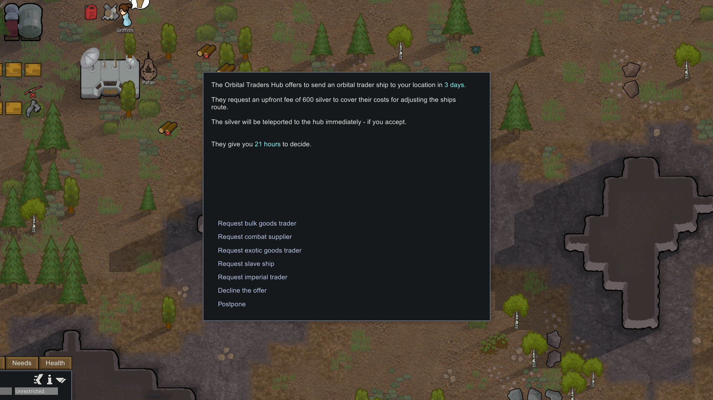
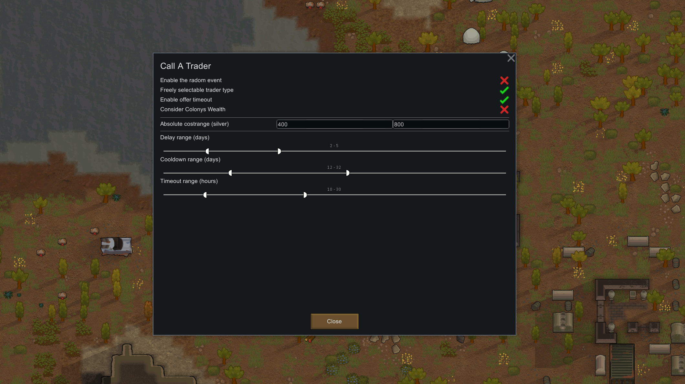

# Rimworld-Mod: Call-A-Trader 

## Description
This mod enables your pawns to request an orbital trader from the 'Orbital Traders Hub' using the commons console.

## Features
* Adds the "Call the Orbital Traders Hub" option to the commons console.

* Adds an incident event where you can choose if you want to receive an orbital trader in the near future.

* Costs, Delay and Cooldown for the Call-Action are configurable.

## Savegame Compatibility
It should be safe to add/remove this mod to/from your safegames at any time.

## Cross-Mod Compatibility
If you have any of these mods installed known cross mod compatibilty problems shoud be fixed. This of course cannot be a guarantee everything will always work fine, so if you encounter any problems feel free to report them here.
* [AUTOMATIC's Trader Ships Mod](https://steamcommunity.com/workshop/filedetails/?id=2046222331)
  * Fix: Now spawns the correct type of tradeship requested with Call A Trader's event

## Other
_This mod was inspired by [KiameV's "Call Trade Ships" mod](https://github.com/KiameV/rimworld-calltradeships)._
